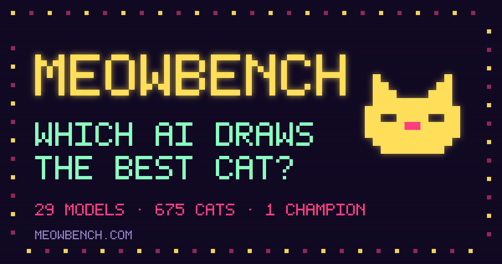
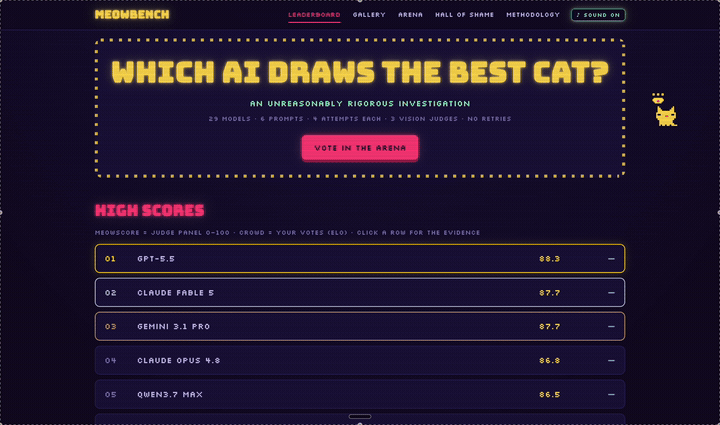

<div align="center">



<br>

### Which AI draws the best cat? 🐱

29 models, from GPT-3.5 to the 2026 frontier, each handed the same crayons and asked to draw a cat **in raw SVG code**. A panel of vision models judges the results. It is exactly as serious and as silly as it sounds.

[](https://meowbench.pages.dev)
&nbsp;
[](https://meowbench.pages.dev)
&nbsp;
[](https://meowbench.pages.dev/gallery/)
&nbsp;
[](LICENSE)

**[Leaderboard](https://meowbench.pages.dev)** · **[Gallery](https://meowbench.pages.dev/gallery/)** · **[Arena](https://meowbench.pages.dev/arena/)** · **[Hall of Shame](https://meowbench.pages.dev/shame/)** · **[Methodology](https://meowbench.pages.dev/methodology/)**

</div>

---

## The tour

<div align="center">

[](https://github.com/adoistic/meowbench/blob/main/docs/media/meowbench-demo.mp4)

🔊 **[Watch the full 53-second tour with sound →](https://github.com/adoistic/meowbench/blob/main/docs/media/meowbench-demo.mp4)** &nbsp;·&nbsp; yes, there is chiptune. yes, a cat chases your cursor.

</div>

---

## 🏆 High scores

The meowscore is a 0–100 median from three vision judges across four attempts per prompt. Blind, no retries.

| # | Model | meowscore | Era | From |
|:-:|:------|:---------:|:---:|:----:|
| 🥇 | **GPT-5.5** | **88.3** | 2026 | 🇺🇸 closed |
| 🥈 | **Claude Fable 5** | **87.7** | 2026 | 🇺🇸 closed |
| 🥉 | **Gemini 3.1 Pro** | **87.7** | 2026 | 🇺🇸 closed |
| 4 | Claude Opus 4.8 | 86.8 | 2026 | 🇺🇸 closed |
| 5 | Qwen3.7 Max | 86.5 | 2026 | 🇨🇳 closed |
| 6 | Claude Sonnet 5 | 86.0 | 2026 | 🇺🇸 closed |
| 7 | GLM-5.2 | 85.3 | 2026 | 🇨🇳 open |
| 8 | DeepSeek V4 Pro | 85.2 | 2026 | 🇨🇳 open |
| 9 | MiniMax M2 | 83.7 | 2025 | 🇨🇳 open |
| 10 | Claude Sonnet 4 | 81.7 | 2025 | 🇺🇸 closed |

<sub>…all the way down to Llama 3.1 70B at 37.3. The full 29-model board, with per-prompt breakdowns and every cat, is <a href="https://meowbench.pages.dev">live on the site</a>.</sub>

The gradient is the fun part: 2026 frontier models cluster at the top, and the scores fall off cleanly as you walk back through the generations. You can watch a model era get better at drawing a cat.

---

## 🎮 What's in the arcade

- **Leaderboard** — every model ranked, expand a row for its best cat and per-assignment bars.
- **Gallery** — all 675 surviving cats, filterable by model and assignment. Some are gorgeous. Some are a triangle with a tail.
- **Arena** — two cats, names hidden, you pick the winner. Votes feed a separate crowd Elo the judges have no say in.
- **Hall of Shame** — the lowest scores, plus the 21 attempts that didn't render, produced invalid XML, or tried to smuggle in a `<script>` tag.
- **The whole thing is a 1982 arcade cabinet** — neon on a dark void, CRT scanlines, marquee chase-lights, optional 8-bit soundtrack, and a pixel neko that chases your pointer and naps when you leave it alone.

---

## 🔬 How the judging works

Each model gets the **same six assignments**, four attempts each, zero retries:

| | | |
|---|---|---|
| **minimal** — a minimal, flat-design cat | **realistic** — a sitting cat with fur shading | **action** — a cat riding a bicycle |
| **style** — an origami cat with geometric folds | **constraint** — a cat in **at most 12** SVG elements | **animation** — a cat whose tail sways (SMIL/CSS, no JS) |

Every reply is validated (must parse, must render, no scripts, no external resources), rasterized with resvg, then scored **blind** by three vision judges — Gemini 3.5 Flash, Grok 4.3, and Qwen3-VL 235B — on cat-ness, prompt fidelity, composition, craft, and charm. The meowscore is the median across judges and attempts. The [methodology page](https://meowbench.pages.dev/methodology/) has the whole protocol, limitations included.

Every prompt, SVG, judgment, and score is committed in [`runs/`](runs/) — the benchmark is fully reproducible and the data is yours to use.

---

## 🤖 Built to be read by machines

This is an open benchmark, so it's wide open to crawlers and AI systems:

- [`robots.txt`](packages/site/public/robots.txt) explicitly welcomes every AI crawler — training, search, and assistants alike. No `Disallow`, anywhere.
- [`/llms.txt`](https://meowbench.pages.dev/llms.txt) serves the full leaderboard and methodology as clean markdown, generated from the real run.
- schema.org `Dataset` metadata and a sitemap round it out.

Use it, cite it, train on it, quote it. That's the point.

---

## 🛠 Run it yourself

A pnpm + TypeScript monorepo:

```
packages/
  harness/       # the eval CLI — generate cats, judge them, score them (OpenRouter)
  site/          # the arcade — Astro static site, deploys to Cloudflare Pages
  vote-worker/   # the arena's brain — Cloudflare Worker + D1, per-model Elo
runs/            # committed benchmark runs: every SVG, judgment, and score
```

```bash
pnpm install
pnpm -F @meowbench/site dev          # run the arcade locally against the latest run
pnpm -F @meowbench/harness cli --help  # the benchmark harness

# estimate what a fresh run would cost before spending a cent:
pnpm -F @meowbench/harness cli run --run-dir runs/my-run --estimate
```

Point the harness at an OpenRouter key, and it'll run the whole suite, judge it, and drop a new folder in `runs/` that the site picks up automatically.

---

<div align="center">

Built by **[Adnan](https://github.com/adoistic)** · [MIT](LICENSE) · no cats were harmed, several were poorly drawn

**★ if this made you smile, [star it](https://github.com/adoistic/meowbench) — it keeps the neko fed.**

</div>
